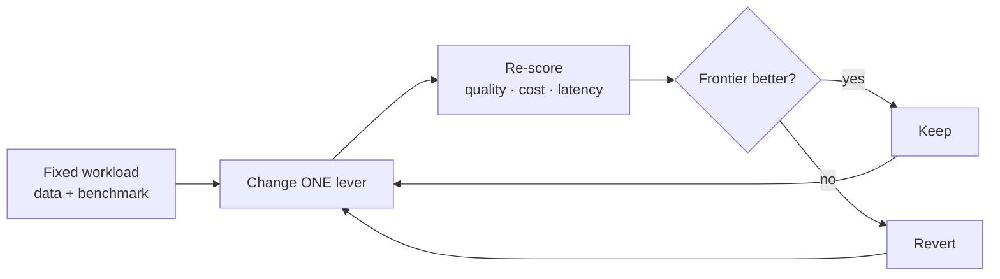
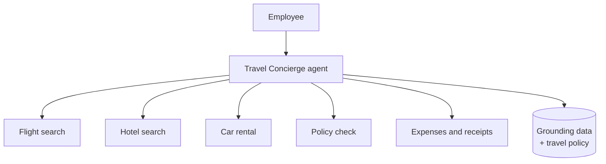

# Demos

*"I understand a model — now how do I make a whole workload cheaper, faster, and just as good?"*

A demo is a reusable scenario — data, instructions, and a benchmark — we point at
real Microsoft Foundry deployments. Demos let us weigh different models in the
context of an **end-to-end story** rather than in isolation: the same workload
becomes a place to practice [model optimization](../docs/GLOSSARY.md#model-optimization)
and [agent optimization](../docs/GLOSSARY.md#agent-optimization) with real
trade-offs. Each demo is self-contained in its own subfolder.

Every demo follows the same journey — [hill climbing](../docs/GLOSSARY.md#hill-climbing)
toward a better frontier: hold the workload fixed, pull one
[optimization lever](../docs/GLOSSARY.md#optimization-lever), re-score, and keep only
what improves the cost/quality/latency frontier (see also
[right-sizing](../docs/GLOSSARY.md#right-sizing) and
[tokenomics](../docs/GLOSSARY.md#tokenomics)).

## Contoso Travel

Contoso Travel is a fictitious company that helps enterprise employees manage their
travel bookings and expenses to be compliant with company policy. Today it's a
single concierge agent that handles each task with a tool; the same scenario can be
decomposed into specialized agents later without changing the data or benchmark.

Levers we pull: instruction rungs (grounding → policy → preferences → output →
safety), a Model Router mode or model subset, or an Agent Optimizer run.

See: [contoso-travel](./contoso-travel)
