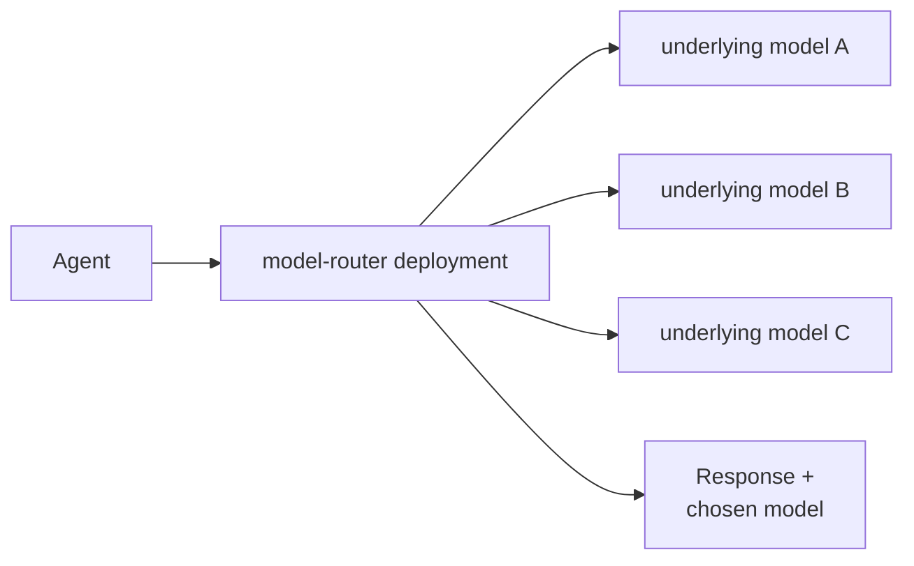
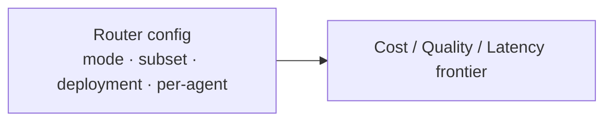

# Model router in Microsoft Foundry

> **One endpoint, best-fit model per request.** The Microsoft Foundry
> model router is itself a deployable model — send everything to
> `model-router` and it picks the underlying model to run.

Model router in Microsoft Foundry is a deployable chat model that picks the
best-fit underlying model for each request. It reads the request — system
instructions, conversation history, and tool definitions — routes it to an eligible
model, and returns that model's answer along with the name of the model it chose.
We address one endpoint; it manages model selection per request.

We can see model router two ways.

### As a model to build agents

We point an agent at the `model-router` deployment instead of a specific model — a
drop-in replacement. There's no custom routing code to write: the router selects the
model, and the response tells us which one answered.

### As an optimization tool to right-size model selection

Every routing configuration — mode, model subset, deployment type, one router per
agent — is an optimization [lever](../../docs/GLOSSARY.md#optimization-lever) for
[right-sizing](../../docs/GLOSSARY.md#right-sizing) model selection. We change one,
re-score, and keep it only when the frontier improves — that's
[hill climbing](../../docs/GLOSSARY.md#hill-climbing).

## Releases

Model router has no versions — it updates in place. We capture each monthly update
as a dated release capsule; the notebooks inside turn that month's features into
optimization levers you can measure.

| Release | Focus | Capsule |
|---|---|---|
| aug-2026 | Catch-up: routing modes, model subsets, deployment types, failover, agentic routing | [aug-2026](aug-2026/) |

## Learn more

- [Model router for Microsoft Foundry — concepts](https://learn.microsoft.com/en-us/azure/foundry/openai/concepts/model-router)
- [How to use model router](https://learn.microsoft.com/en-us/azure/foundry/openai/how-to/model-router)
- [Model Router primer](../../docs/primers/model-router.md)
- [Glossary](../../docs/GLOSSARY.md)
