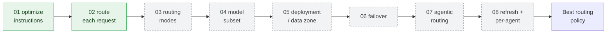
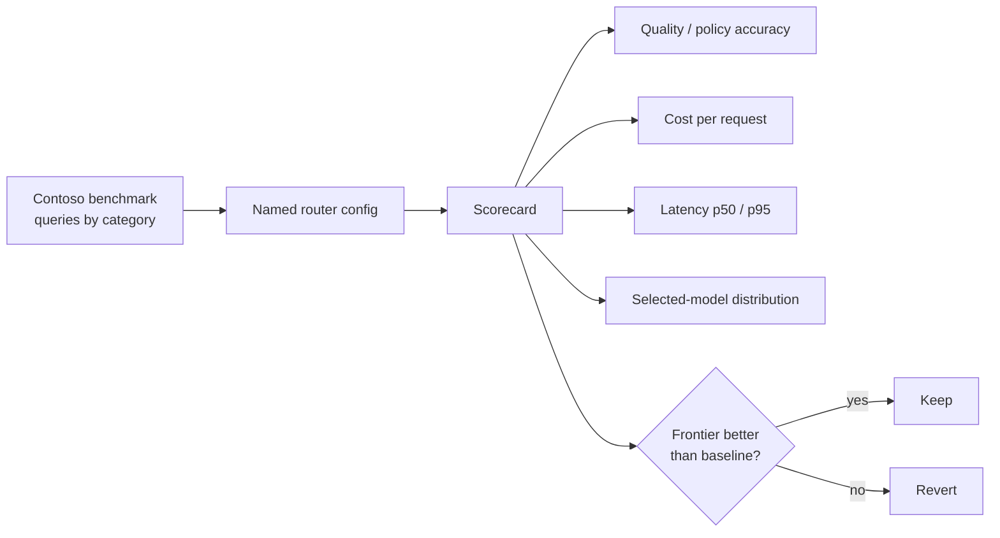

# Model Router — August 2026 — Release Capsule

**Released:** 2026-08-19 · **Publisher:** [Model Router](../README.md) · **Capabilities:** Model Router · Chat Completion · Function Calling

Model router in Microsoft Foundry updates in place, so there are no versions to
track — only dated release drops. This is our first capsule, so it **catches up** on
the features that shipped across earlier updates and turns each one into an
optimization lever you can measure on a real workload.

## Two ways to think about model router

- **Model router is a model.**   We call `model-router` like any chat deployment and read back which underlying model answered. Use this to build agentic AI quickly.
- **Routing is an optimization strategy**.   Each configuration — routing mode, model subset, deployment type, one router per agent — is an [optimization lever](../../../docs/GLOSSARY.md#optimization-lever). Change one, re-score, and keep the updated version only if the frontier improves. That is the essence of [hill climbing](../../../docs/GLOSSARY.md#hill-climbing).

## Before You Begin

| Detail | Value |
|---|---|
| Model card | [model-router — Foundry catalog](https://ai.azure.com/catalog/models/model-router) |
| What's new | [Model router release history](https://learn.microsoft.com/en-us/azure/foundry/foundry-models/whats-new-model-router) |
| Pricing | Billed at the selected underlying model's rate — [current pricing](https://azure.microsoft.com/pricing/details/cognitive-services/openai-service/) |
| Release date | 2026-08-19 |
| Workload | [Contoso Travel demo](../../../demos/contoso-travel/) — shared data, instructions, and benchmark |

This capsule is self-contained: 
- **[00 · Set up your Foundry project](00-setup.ipynb)**
walks you through creating the `contoso-travel-releases` project, deploying a
`model-router` (plus optional baseline and eval models), and standing up the
`contoso-travel-concierge` prompt agent. 
- It reuses the
[Contoso Travel demo](../../../demos/contoso-travel/) for data, instructions, and the benchmark, so the workload stays fixed while we change one routing lever at a time.
- Authenticate with `az login` — no API key needed. 
- **Required environment variables** — copy [`sample.env`](sample.env) to `.env` in this folder and fill it in (`.env` is git-ignored):

 

## The notebook series

Each notebook opens with a falsifiable developer question — *does changing X improve
Y?* — deploys a **named router** with one configuration change, runs the Contoso
benchmark, and reads the scorecard to accept or reject the change. The lever in each
notebook maps to the release that introduced it.

| # | Notebook | Question: does changing X improve Y? | Lever (release) |
|---|---|---|---|
| 00 | [`00-setup.ipynb`](00-setup.ipynb) | Is our project, router, and agent ready before we optimize? | Self-contained setup |
| 01 | [`01-optimize-instructions.ipynb`](01-optimize-instructions.ipynb) | Can we lift quality on a fixed frontier model just by optimizing its instructions? | Agent Optimizer + rubric evaluator (from code) |
| 02 | [`02-route-each-request.ipynb`](02-route-each-request.ipynb) | Can one `model-router` endpoint serve the whole travel workload, and can we see which model answered? | Router as a model + `response.model` (2025 preview) |
| 03 | `03-routing-modes.ipynb` | Does Cost mode lower cost per request without dropping below the policy-accuracy gate — and does Quality mode lift accuracy enough to justify the spend? | Routing modes (GA `2025-11-18`) |
| 04 | `04-model-subset.ipynb` | Does constraining the model subset hold quality while cutting cost and routing variance? | Custom model subset (GA `2025-11-18`) |
| 05 | `05-deployment-and-data-zone.ipynb` | Does a Data Zone Standard deployment keep the frontier while meeting data-residency policy? | Deployment types (GA `2025-11-18`) |
| 06 | `06-automatic-failover.ipynb` | Does automatic failover preserve success rate and tail latency when a model is unstable? | Automatic failover (Mar 2026) |
| 07 | `07-agentic-routing.ipynb` | Does routing the agent's tool-calling turns beat pinning one model, now that it selects across OpenAI, OSS, and Anthropic? | Agentic routing across providers (Aug 2026) |
| 08 | `08-refresh-and-per-agent-routers.ipynb` | Does giving each agent its own routing policy beat one global router, with the refreshed model pool? | Model refresh + per-agent routers (Aug 2026) |

Notebooks 00–02 are built and runnable today. The later lever notebooks (03–08)
roll out as fully runnable notebooks throughout August 2026 — the rows below are
the planned sequence, and each becomes a live link as it ships.

## The journey

_Green steps ship in this release (00–02); dashed steps roll out through August 2026._

## How we score each step

We follow Foundry's model-router evaluation guidance: judge a change against
**four dimensions together**, never one aggregate score.

Each notebook records the run context (baseline, router version, routing mode,
subset, dataset) so comparisons stay reproducible, and ends with an
"observation → what to try next" hand-off into the following notebook. The local
scorecard reuses [`demos/contoso-travel/benchmark/`](../../../demos/contoso-travel/benchmark/);
the [Model Router Auto Evaluation toolkit](https://github.com/microsoft-foundry/Model-Router-Auto-Evaluation)
is the automation path for larger runs.

## References

- [Evaluate model router for your workload](https://learn.microsoft.com/en-us/azure/foundry/openai/how-to/evaluate-model-router) — the hill-climbing evaluation method and scorecard dimensions.
- [Model router concepts](https://learn.microsoft.com/en-us/azure/foundry/openai/concepts/model-router) — routing modes, model subsets, deployment types, failover.
- [Use model router with Foundry agents](https://learn.microsoft.com/en-us/azure/foundry/openai/how-to/model-router-agents) — agentic, tool-aware routing.
- [Model router release history](https://learn.microsoft.com/en-us/azure/foundry/foundry-models/whats-new-model-router) — the features this capsule catches up on.
- [Model Router primer](../../../docs/primers/model-router.md) · [Contoso Travel demo](../../../demos/contoso-travel/)
