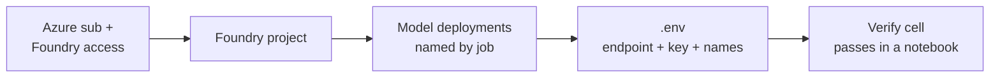

# Model Releases Quickstart

> **Do this once.** Every capsule notebook in this repo assumes you've completed the four steps below. When a notebook can't find a required env var, it will point you back here.

**Grounded in Microsoft Learn:**
- [Quickstart: Get started with Microsoft Foundry SDK](https://learn.microsoft.com/en-us/azure/foundry/quickstarts/get-started-code) 
- [Overview of Microsoft Foundry Models](https://learn.microsoft.com/en-us/azure/foundry/concepts/foundry-models-overview) 
- [Explore the Microsoft Foundry model catalog](https://ai.azure.com/catalog)

---

## What you'll set up



---

## 1. Prerequisites

- An **Azure subscription** with access to Microsoft Foundry
  ([sign-in](https://ai.azure.com)).
- **Azure CLI** logged in: `az login` — see
  [Azure CLI docs](https://learn.microsoft.com/en-us/cli/azure/get-started-with-azure-cli).
- **Python 3.10+** (the devcontainer ships 3.12) or open this repo in the
  provided devcontainer, which installs `requirements-dev.txt` for you.

## 2. Create a Foundry project

1. Go to [ai.azure.com](https://ai.azure.com) and sign in with your Azure account.
2. Slide the **New Foundry** toggle (top-right) to **on**.
3. When prompted, complete the **Create project** wizard. Alternatively, click the project drop-down and select **Create project** to trigger the flow manually.
4. If prompted to create a resource group in the Azure Portal, complete that step before continuing.
5. Note the **resource group name** and **project name** — you need them in Step 4.
6. Wait for creation to complete.

Full walkthrough: [Create a project in the Foundry portal](https://learn.microsoft.com/en-us/azure/foundry/how-to/create-projects).

> **Other ways to create a project** (Azure CLI, Foundry Toolkit) will be documented here in a future update.

## 3. Deploy the models a capsule needs

Each release capsule lists the exact deployments it expects in its
**Before You Begin** section. To deploy a model:

1. In your project, open **Model catalog**.
2. Select the model → **Deploy**.
3. Name the deployment **by the job it does**, not the raw model name
   (e.g. `router-nano`, `policy-mini`, `planner-gpt41`) — this makes it easy
   to swap models later without touching notebooks.

Full reference: [Deploy models in Microsoft Foundry](https://learn.microsoft.com/en-us/azure/foundry/how-to/deploy-models-openai).

> **Other deployment paths** (Azure CLI, Foundry Toolkit) will be documented here in a future update.

## 4. Configure `.env`

**Step 1 — Authenticate with Azure**

```bash
az login
```

**Step 2 — Run the setup script**

From the repo root, substituting your resource group and project name from Step 2.
If you get a permission error, make the scripts executable first:

```bash
chmod a+x scripts/*.sh
```

```bash
./scripts/setenv.sh --use <resource-group> <project-name>
```

The script copies [`scripts/sample.env`](../../scripts/sample.env) to `.env`, then reads
the endpoint and API key from the project and fills them in automatically.
Pass `--force` to overwrite an existing `.env`.

To load the variables into your current terminal session:

```bash
source .env
```

Full reference: [`scripts/setenv.spec.md`](../../scripts/setenv.spec.md).

Then set at minimum:

| Variable | What it is |
|---|---|
| `MICROSOFT_FOUNDRY_ENDPOINT` | Your project's inference endpoint URL |
| `MICROSOFT_FOUNDRY_API_KEY` | Project API key (or use `azure-identity`) |
| `MICROSOFT_FOUNDRY_REGION` | Region you deployed into (e.g. `swedencentral`) |
| `<JOB>_DEPLOYMENT` | One per deployment used by the capsule you're running |

Capsules add capsule-specific vars in their **Before You Begin**. The
`.env` file is git-ignored — never commit it.

> **Entra ID auth.** Capsules that authenticate with `azure-identity` (for
> example the model router series) need only `MICROSOFT_FOUNDRY_ENDPOINT` plus
> `az login` — no API key — along with their own `<JOB>_DEPLOYMENT` var such as
> `AZURE_MODEL_ROUTER_DEPLOYMENT`.

## 5. Verify

Every capsule notebook opens with an **env precheck cell** that prints
✅ when your `.env` is complete and ⚠️ pointing back here when it isn't.
You can also run this one-liner from the repo root:

```bash
python -c "import os,dotenv; dotenv.load_dotenv(); \
required=['MICROSOFT_FOUNDRY_ENDPOINT','MICROSOFT_FOUNDRY_API_KEY']; \
missing=[v for v in required if not os.getenv(v)]; \
print('✅ base env OK' if not missing else f'⚠️ missing: {missing}')"
```

---

## Troubleshooting

- **`401 / 403`** — API key wrong, or your identity lacks the *Cognitive
  Services User* role. See
  [Foundry RBAC](https://learn.microsoft.com/en-us/azure/foundry/concepts/rbac-azure-ai-foundry).
- **`404 model not found`** — deployment name in `.env` doesn't match
  what's in the portal. Match them exactly (case-sensitive).
- **Quota errors** — request a quota increase from the portal or pick a
  smaller model to start. See
  [Manage quotas](https://learn.microsoft.com/en-us/azure/foundry/how-to/quota).
- **Region mismatch** — a model isn't available in your region; deploy
  it to the region listed in the capsule's Before You Begin.

Still stuck? Open an issue against this repo with the failing cell's
output.
